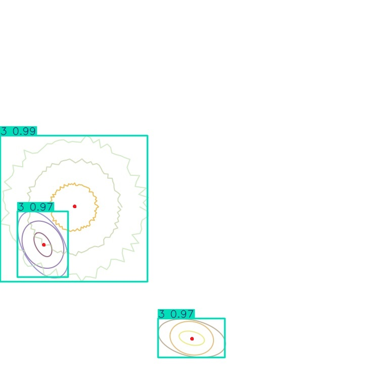
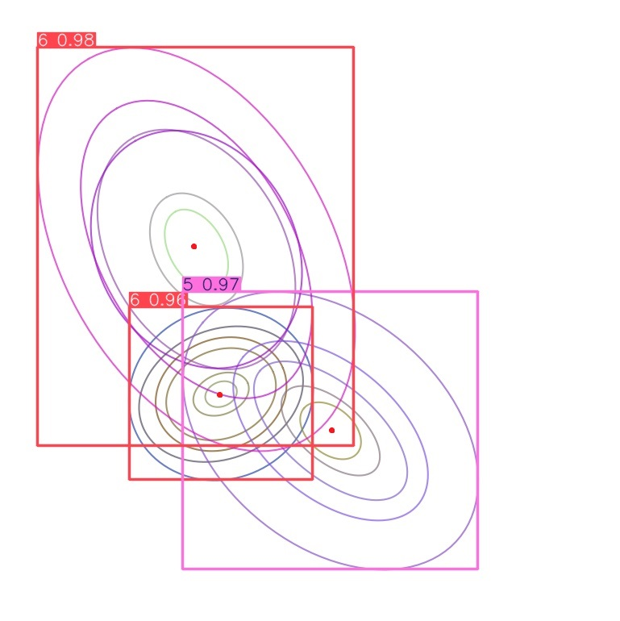
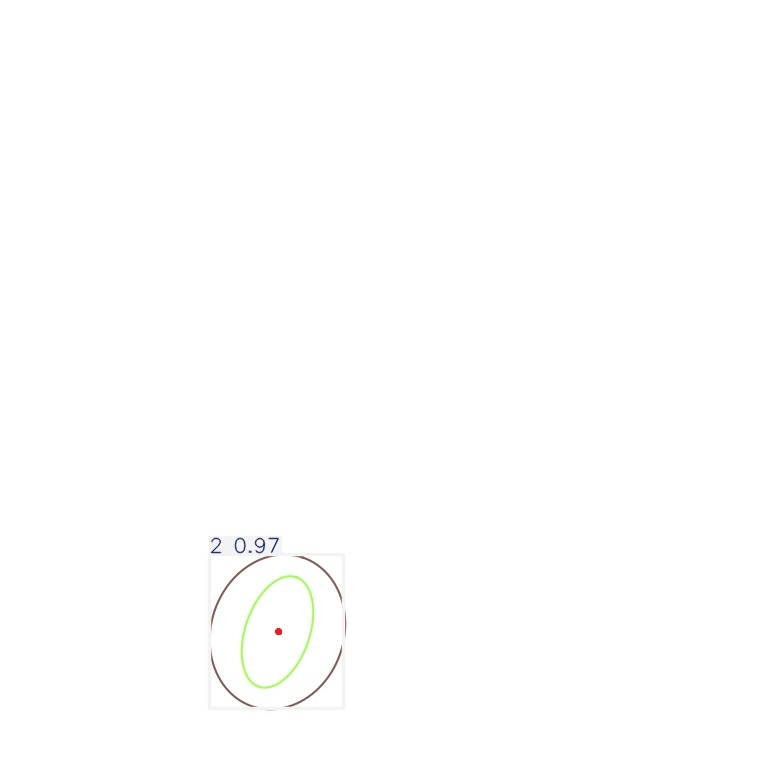

# Contour-Detection
## Overview
This is my implementation for the contour-detection task given to me during batch13 vinAI interview. In short, this model aim to detect the bounding box, the center, the number of circle for each plot in the image. The main method used here is YOLO - You Only Look Once. I have coded it from scratch (TinyYOLO) and utilized ultralytics library so i can provide a comprehensive comparison between each model but it turn out that my scratch model has to faced some problems.

### Overview of the dataset
<p align="center">
  
  
  
  
</p>

## Challenge
- Overlap circle : Some generated images have their contour plot overlap on each other, making detection task more challenging.
- Metrics : Intuitively, the number of circle in each plot can be somehow perceived as "class" and we can do some no-brain move like fit the whole yolo model with "number of circle" as a categorical label but i have tried to implement yolo model with MSE, MAE, ... loss function but it messed up the yolo's paper loss function so much that at the end, i can hardly compare loss of my yolo scratch model with ultralytic model.
- Code : The code is a little bit messy as i have to debug a lot.

## Result
As i mentioned above, it's problematic to compare 2 models which have different training loss and training regime so i will use ultralytic's metric - which will of course lower my scratch model performance.

| Model Name          | Box Loss | mAP@50  | Center Loss (MSE) |
| ------------------- | -------: | ------: | -----------------: |
| Scratch (Tiny YOLO) |   0.3120 | 0.76412 |             2.861  |
| YOLOv8n             |   0.1140 | 0.99416 |             0.534  |
| YOLOv8s             |   **0.0914** | 0.99475 |             **0.419**  |
| YOLO11n             |   0.1014 | 0.99416 |             0.462  |
| YOLO11s             |   0.1017 | **0.99488** |             0.453  |

### Scratch model (TinyYOLO) demo - click for a better view
<p align="center">
  
  
  
  
</p>

### YOLOV8n demo
<p align="center">
  
  
  
  
</p>

### YOLOV8s demo
<p align="center">
  
  
  
  
</p>

### YOLO11n demo
<p align="center">
  
  
  
  
</p>

### YOLO11s demo
<p align="center">
  
  
  
  
</p>

## Installation
Clone this repo and install with
```
pip install -r requirements.txt
```
Anyway i have modified my local ultralytics library so i do not think you can re-run this code properly, but you can re-run the scratch yolo model without any issues.

## Training
To train scratch model run : 
```
python modules/train_scratch.py
```

## File description
loss.py: evaluate function used in training phase <br>
dataset.py: create data <br>
model.py: contain architecture of tinyYOLO <br>
utils.py : some auxiliary functions that support iou, plot, ... <br>
train_scratch.py: train my scratch model <br> 
train_yolo_ultra.py: train ultralytic yolo model <br>
